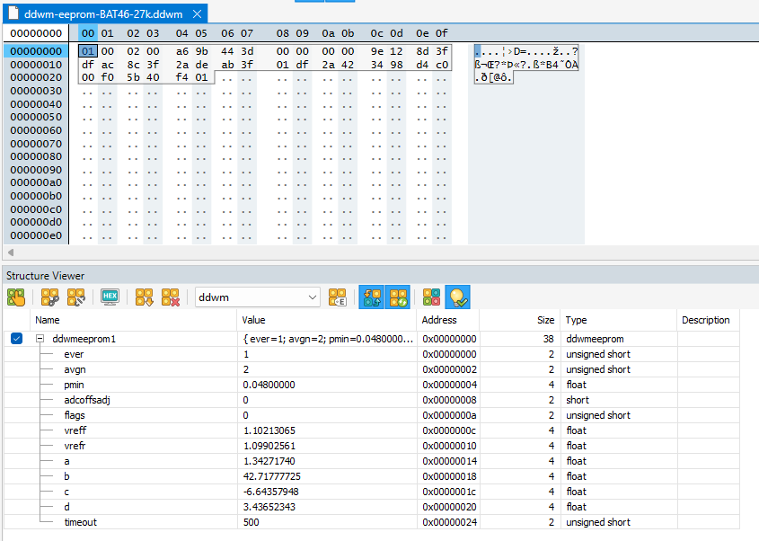

# QRP DIGITAL RF POWER & VSWR METER - modifications of Chinese copy

# Issues

On receipt, the Chinese copy had several problems:
- SMA connectors were not soldered properly;
- displayed power was frequency dependent; and
- displayed VSWR was power dependent.

The firmware was modified to evaluate some different user interface ideas.

A careful calibration was conducted where power was measured and plotted against ADC count to perform a curve fit to calulate power from ADC count.
Whilst it was good on one band, it remained frequency dependent and displayed VSWR was power dependent, less so, but room for improvement.

## Coupled transformers

The use of a binocular ferrite couples the voltage sampling and current sampling transformers, and they are supposed to be independent.

A new transformer was wound using a pair of Fair-rite 2643250402 suppression sleeves, it fits in the same space as the original binocular core.
It would have been better if the I2C display wires were not so close to the transformer, a sub optimal PCB layout.

This one measure improved indicated VSWR independence of power level.

## Detector issues

The detector produced somewhat lower voltage than expected, and was probably the cause of the frequency dependent output.

The diodes were replaced with BAT46JFILM SMD diodes which produced higher output, and much less frequency sensitivity up to 30MHz.
It would appear the manufacturer used SBD intended for switched mode power supplies, diodes with may too much junction capacitance.

G8GYW's diodes were 1n5711. BAT46 diodes are a little more 'sensitive' to very weak signal, so are usable to good accuracy to lower power levels.

To accomodate the increased output voltage, and to raise the calibration limit to 16W, the 18k divider resistors were replaced with 27k 0603 1% resistors.

Beware of buying BAT46 diodes from Aliexpress etc, they offer unbelievable prices and ship power diodes.

## Calibration

An LTSPICE model of the detector was constructed and a third order polynomnial fit of Vinpk to Vodc was calculated.

The curve fit above is very good from equivalent to 50mW to 16W.

The parameters are stored in EEPROM.

Parms vref and vrefr are nominally 1.1, and are tweaked for fine calibration of actual build components.

# Result

The issues listed were satisfactorily resolved:
- accuracy of power is good across 1.8 to 30MHz from 50mW to ~20W;
- InsertionVSWR is good from 3.5-30MHz;
- minimum power displayed is restricted to 50mW so that garbage is not calculated, VSWR will not be calculated if Pref<50mW; and
- VSWR accuracy is good and largely insensitive to power level.

Owen Duffy
31/07/2025

